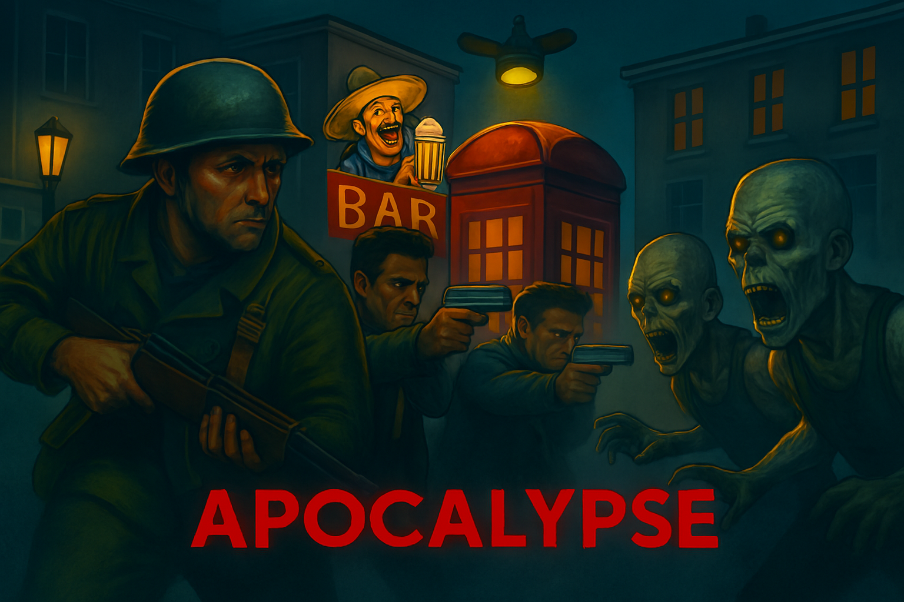

<h1 align="center">
  Apocalypse - 2D PvE Shooter  
</h1>

 

(click the image to visit the game)

#
### Backstory

 This is the first game i ever made, i made it 5 years ago for a school project in Scratch.
  It's extremely buggy and i never got to finish it but it's still one of my favourite projects as it reminds me 
  of which lows i come from so i thought i might share this with the 
  world to remind everyone we all start from something and to never give up!

  

 PS. I shared the 

 save files for anyone interested
  
#

### Show your support

   

Give a ⭐ if you like this game!
